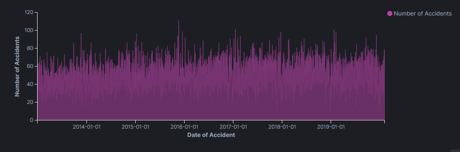

# T9Hacks  -  Data Saves lives

## Project Details

**Data Saves lives** is a tool which allow's user to get insight from state's safe roads and non-safe roads. It provides detailed information about type of accident and road safety index.
User can plan their road trip based on the safety index of the route

## Technology Stack

 1. Colorado Accident Crash dataset
 2. Python scripts
 3. Elastic Search
 4. Kibana dashboard

		Kibana Dashboard

	The line graph depicts the number of accidents reported on specific dates between 2014 to 2019. We can interpret that there are more number of accidents reported in the year of 2016 and 2019. The frequency of accidents is primarily higher in the year 2016 and 2019.

	The graphs explains the location where more accidents occured in the state of Colorado. The higher the freqency of accidents in particular neighbourhood will be focused in bigger size inside the cluster.

	We are able to display the accident zone where users tends to get injured more. Color variation indicates the severioty of the zone accident occurance. Above chart displays accident zones reported in the year of 2016 and 2019.

	We are able to categorize the accidents based on the reasons associated with the accident. main reasons for accidents are 
	1. Careless Driving
	2. Followed too closely
	3. Failed to Yield Row

	we are able to display accident occured in perticular type of locations, like Parking lots, Intersection, Highway Interchange. Based on the accident reported from 2016 to 2019 we can visualize that accident occured at non-Itersection roads.

	we were able to display number of deaths occured per year based on the records from 2013 to 2019 dataset.
